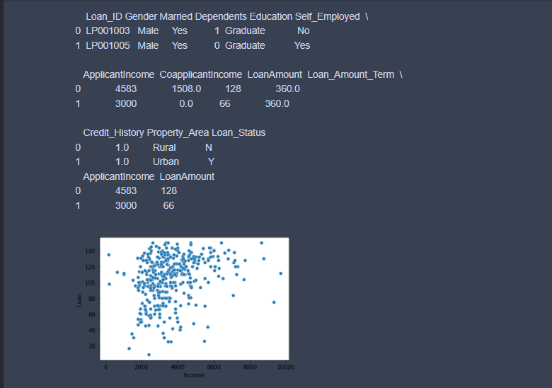
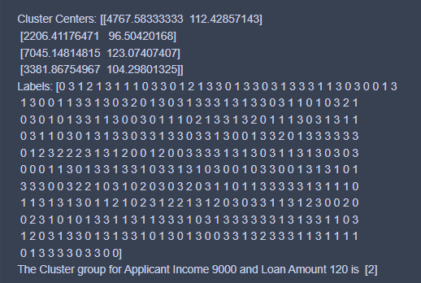

# Implementation of K-Means Clustering Algorithm
## Aim
To write a python program to implement K-Means Clustering Algorithm.
## Equipment’s required:
1.	Hardware – PCs
2.	Anaconda – Python 3.7 Installation

## Algorithm:
### Step1
Import Pandas,mathplotlib.pyplot,sklearn,seaborn,warnings.
### Step2
Read the csv file using df.head() and assign it to a variable.
### Step3
Plot the group using scatterplot.
### Step4 
Find the centroid using KMeans from Sklearn module.
### Step5
Display the graphs and the result.
## Program:
```
import pandas as pd
import matplotlib.pyplot as plt
from sklearn.cluster import KMeans
import seaborn as sns
import warnings
warnings.filterwarnings('ignore')
X1=pd.read_csv("clustering.csv")
print(X1.head(2))
X2=X1.loc[:,['ApplicantIncome','LoanAmount']]
print(X2.head(2))
X=X2.values
sns.scatterplot(X[:,0],X[:,1])
plt.xlabel("Income")
plt.ylabel("Loan")
plt.show()
kmean=KMeans(n_clusters=4)
kmean.fit(X)
print("Cluster Centers:",kmean.cluster_centers_)
print("Labels:",kmean.labels_)
predicted_class=kmean.predict([[9000,120]])
print("The Cluster group for Applicant Income 9000 and Loan Amount 120 is ",predicted_class)
```
## Output:


## Result
Thus the K-means clustering algorithm is implemented and predicted the cluster class using python program.